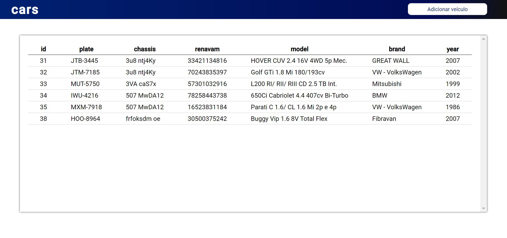

<h1 align="center">
cars</h1>

  

## 🚀 Tecnologias

Esse projeto foi desenvolvido com as seguintes tecnologias:

- JavaScript, HTML, CSS
- [ReactJs](https://reactjs.org/) (_Flux_ _Pattern_)
- [Node.js](https://nodejs.org/en/)
- [Sequelize](https://sequelize.org/)
- [Mocha](https://mochajs.org/)
- SQL Server

## 💻 Projeto

Simples CRUD de veículos. O funcionamento do sistema pode ser visto no vídeo: [LINK](https://www.loom.com/share/88bd10663592410d92b633f6169bd062)

## 🔥 Como usar

### Front-end
- É necessário ter o [Node.js](https://nodejs.org/en/) e [npm](https://www.npmjs.com/) instalados
- Clone esse repositório: `git clone https://github.com/romaSilva/cars.git`
- Abra o terminal na pasta: `web`
- Instale as dependências do projeto, digitando no terminal: `npm install`
- Enfim, para rodar a aplicação digite: `npm start`

### Back-end
- É necessário ter o [Node.js](https://nodejs.org/en/) e [npm](https://www.npmjs.com/) instalados
- Clone esse repositório: `git clone https://github.com/romaSilva/cars.git`
- Abra o terminal na pasta: `server`
- Instale as dependências do projeto, digitando no terminal: `npm install`
- Enfim, para rodar a aplicação digite: `npm run dev`
​

## ♻️ Como contribuir

- Faça um fork desse repositório;
- Cria uma branch com a sua feature: `git checkout -b minha-feature`;
- Faça commit das suas alterações: `git commit -m 'feat: Minha nova feature'`;
- Faça push para a sua branch: `git push origin minha-feature`.

Depois que o merge da sua pull request for feito, você pode deletar a sua branch.